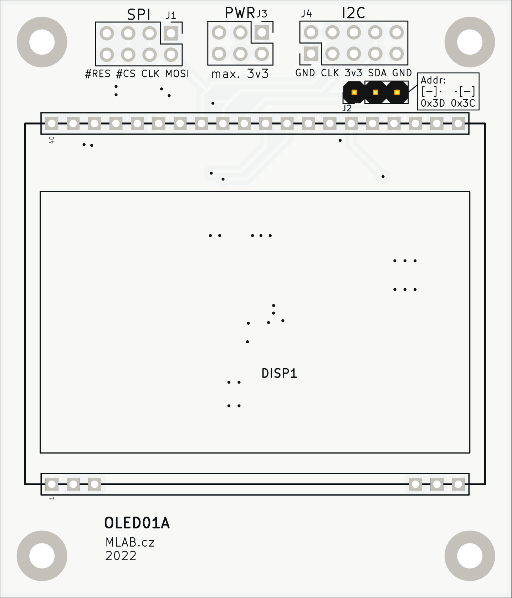

# I2C/SPI OLED module

MLAB module for connecting OLED displays [EA OLEDM128-6GGA](https://www.lcd-module.com/fileadmin/eng/pdf/grafik/oledm128-6e.pdf). The module contains standard MLAB headers and internal 12V power supply for the OLED display. The module can be manufactured in SPI or I2C variant. Display is based on [SSD1306](https://cdn-shop.adafruit.com/datasheets/SSD1306.pdf) controller. 

Module can be powered only by 3.3V. 

## Design

## Schematics

